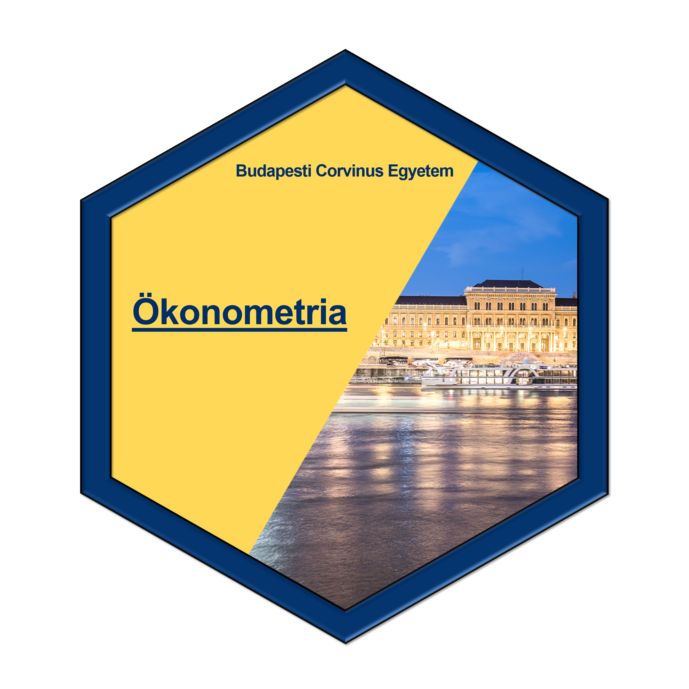

# Mi ez a projekt? {#index}

```{r setup, include=FALSE}
knitr::opts_chunk$set(echo = T, comment = "#>", warning = F, message = F, cache = T, error = T)
library(tidyverse)
library(gt)
library(knitr)

theme_set(theme_grey() + theme(legend.position = "bottom", 
                  text = element_text(size = 12), 
                  legend.box = "vertical", 
                  legend.key = element_blank()))
```

```{r echo = F}

```


Rövid leírás a bookdownhoz [...]


```{css, echo=FALSE}
p {
text-align: justify;
}
.author {
  font-size: 20px;
  text-align: center;
} 
.title {
  text-align: center;
}
```